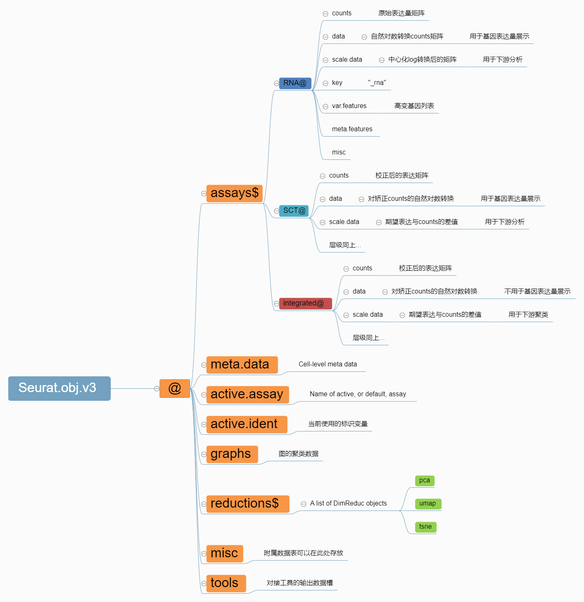

# scRNA-seq-tutorial
The relevant codes used by WWY for analyzing **scRNA-seq**. Please be careful!!!
## Environment
R 4.3.2 
Seurat V5
> Conda::R432
## Seurat Object

## scRNA-Tutorial
### 0. Cellranger
### 1. Quality Control
### 2. Data integration and FindCluster
### 3. Cell Annotation & Subtype Annotation
### 4. Trajectory Analysis
### 5. CellChat Analysis
### 6. scData Expression Analysis
### 7. scTF Analysis

